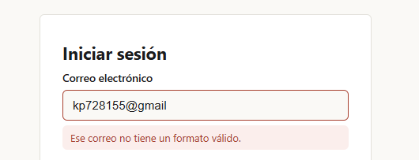
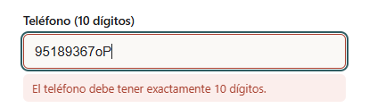
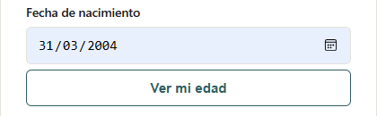
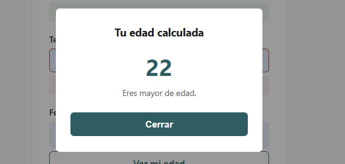
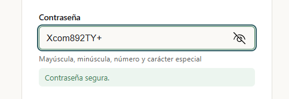
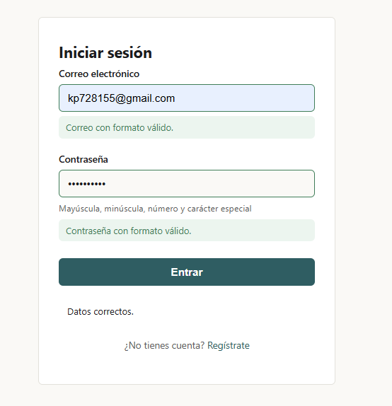

# Utileria

## Portada

Este repositorio contiene una librería de JavaScript funcional, sin frameworks
y sin componentes visuales, que resuelve un problema muy común en cualquier
formulario web: repetir una y otra vez la misma lógica de validación
(correos, contraseñas, nombres, edades, etc.) en cada proyecto.

En lugar de copiar y pegar expresiones regulares y cálculos de fecha entre
formularios, se centra la lógica en un solo archivo con 8
funciones puras (reciben datos, devuelven un resultado) que se pueden reutilizar
en cualquier formulario, modal o página de login.

Este repositorio incluye, además de la librería, dos páginas de ejemplo que
la usan:

- `index.html` — formulario de registro con validación en tiempo real y una
  ventana modal que muestra la edad calculada.
- `login.html` — formulario de inicio de sesión que valida correo y
  contraseña.

---

## Instalación

Copia la carpeta `js/` en tu proyecto y agrega el script antes de tu propio
código, justo antes de cerrar `</body>`:

```html
<script src="js/utileria.js"></script>
<script src="tu-script.js"></script>
```

No requiere ninguna dependencia externa ni proceso de build.

---

## Uso

Todas las funciones quedan disponibles como funciones globales una vez que
se carga `utileria.js`.

Ejemplos:

### validarCorreo(correo)

Valida que un texto tenga el formato `usuario@dominio.extension`.

**Función:**

```javascript
function validarCorreo(correo) {
  if (typeof correo !== "string") return false; // Valida el tipo de dato
  const patron = /^[^\s@]+@[^\s@]+\.[^\s@]{2,}$/; // Reconoce el patrón y el formato
  return patron.test(correo.trim());
}
```

**Ejemplo:**

```javascript
validarCorreo("ana@correo.com"); // true
validarCorreo("ana@correo");     // false
validarCorreo("ana correo.com"); // false
```


### soloLetras(texto)

Valida que un texto contenga solo letras (incluye vocales acentuadas y ñ) y
espacios, sin números ni símbolos.

**Función:**
```javascript
function soloLetras(texto) {
  if (typeof texto !== "string" || texto.trim() === "") return false; // Verifica el tipo de dato
  const patron = /^[a-zA-ZáéíóúÁÉÍÓÚñÑüÜ\s]+$/; // Reconoce los caracteres disponibles
  return patron.test(texto);
}
```
**Ejemplo:**
```javascript
soloLetras("María José"); // true
soloLetras("Andrés Peña"); // true
soloLetras("Ana123");      // false
```

### validarLongitud(numero, maxLongitud)

Valida que un número (o texto numérico) no tenga más dígitos que
`maxLongitud`. Útil para teléfonos, códigos postales, etc.

**Función:**

```javascript
function validarLongitud(numero, maxLongitud) {
  if (numero === null || numero === undefined) return false; // Reconoce si existe contenido
  const soloDigitos = String(numero).replace(/[^0-9]/g, ""); // Valida el patrón de solo números
  if (soloDigitos.length === 0) return false; // Revisa si lo enviado no es menor a 0
  return soloDigitos.length <= maxLongitud;
}
```

**Ejemplo:**

```javascript
validarLongitud(5512345678, 10); // true  (10 dígitos)
validarLongitud(55123456789, 10); // false (11 dígitos)
```

### calcularEdad(fechaNacimiento)

Calcula la edad en años cumplidos a partir de una fecha de nacimiento.

**Función**

```javascript
function calcularEdad(fechaNacimiento) {
  const nacimiento = new Date(fechaNacimiento);
  if (isNaN(nacimiento.getTime())) return NaN;

  const hoy = new Date();
  let edad = hoy.getFullYear() - nacimiento.getFullYear();
  const mesActual = hoy.getMonth() - nacimiento.getMonth();
  const noHaCumplidoAun =
    mesActual < 0 || (mesActual === 0 && hoy.getDate() < nacimiento.getDate());

  if (noHaCumplidoAun) edad--;
  return edad;
}
```

**Ejemplo**

```javascript
calcularEdad("2000-05-14"); // p. ej. 26 (depende de la fecha actual)
```

### esMayorDeEdad(fechaNacimiento)

Devuelve `true` si la persona ya cumplió 18 años.

**Función**

```javascript
function esMayorDeEdad(fechaNacimiento) {
  const edad = calcularEdad(fechaNacimiento);
  if (isNaN(edad)) return false;
  return edad >= 18;
}
```

**Ejemplo**

```javascript
esMayorDeEdad("2010-01-01"); // false
esMayorDeEdad("1990-01-01"); // true
```

### validarPassword(password)

Valida que una contraseña tenga mínimo 8 caracteres, al menos una
mayúscula, una minúscula, un número y un carácter especial.

**Función**

```javascript
function validarPassword(password) {
  if (typeof password !== "string") return false;
  const tieneMayuscula = /[A-Z]/.test(password);
  const tieneMinuscula = /[a-z]/.test(password);
  const tieneNumero = /[0-9]/.test(password);
  const tieneEspecial = /[^A-Za-z0-9]/.test(password);
  const longitudValida = password.length >= 8;
  return (
    tieneMayuscula &&
    tieneMinuscula &&
    tieneNumero &&
    tieneEspecial &&
    longitudValida
  );
}
```

**Ejemplo**

```javascript
validarPassword("Segura#123"); // true
validarPassword("segura123");  // false (falta mayúscula y carácter especial)
```

### formatearTelefono(telefono)

Recibe un teléfono en cualquier formato (con espacios, guiones o
paréntesis) y, si tiene exactamente 10 dígitos, lo devuelve formateado
como `(XXX) XXX-XXXX`. Si no tiene 10 dígitos, devuelve `null`.

**Función**

```javascript
function formatearTelefono(telefono) {
  if (typeof telefono !== "string" && typeof telefono !== "number")
    return null;
  const digitos = String(telefono).replace(/\D/g, "");
  if (digitos.length !== 10) return null;
  const lada = digitos.slice(0, 3);
  const parte1 = digitos.slice(3, 6);
  const parte2 = digitos.slice(6, 10);
  return `(${lada}) ${parte1}-${parte2}`;
}
```

**Ejemplo**

```javascript
formatearTelefono("5512345678");     // "(551) 234-5678"
formatearTelefono("551-234-5678");   // "(551) 234-5678"
formatearTelefono("12345");          // null
```

### capitalizarPalabras(texto)

Recibe un texto y devuelve cada palabra con la primera letra en mayúscula
y el resto en minúscula. Sirve para normalizar nombres capturados en
mayúsculas o minúsculas.

**Función**

```javascript
function capitalizarPalabras(texto) {
  if (typeof texto !== "string") return "";
  return texto
    .trim()
    .toLowerCase()
    .split(/\s+/)
    .map((palabra) => palabra.charAt(0).toUpperCase() + palabra.slice(1))
    .join(" ");
}
```

**Ejemplo**

```javascript
capitalizarPalabras("ANA lópez GARCÍA"); // "Ana López García"
```

---

## Integración en el repositorio

- **Formulario (`index.html`)**: usa `soloLetras`, `validarCorreo`,
  `validarLongitud`, `validarPassword`, `capitalizarPalabras` y
  `formatearTelefono`, mostrando un mensaje debajo de cada
  campo cuando el valor no es válido.
- **Modal (`index.html`)**: el botón "Ver mi edad" llama a `calcularEdad`
  y `esMayorDeEdad` sobre la fecha capturada y despliega el resultado en
  una ventana modal, sin recargar la página.
- **Login (`login.html`)**: usa `validarCorreo` y `validarPassword` para
  validar el formulario de inicio de sesión antes de "enviarlo".

## Capturas de pantalla

Formato invalido de correo:




Fomato invalido para telefono:




Selección de fecha:



Muestra de la edad según fecha:



Mostrar formato correcto de contraseña



Login exitoso con datos correctos:



## Estructura del repositorio

```
/utileria
  README.md
  index.html
  login.html
  /css
    styles.css
  /js
    utileria.js
  /img
    (capturas de pantalla)
```
